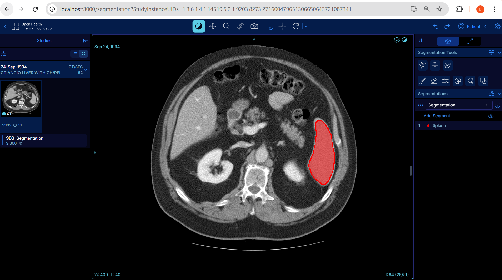
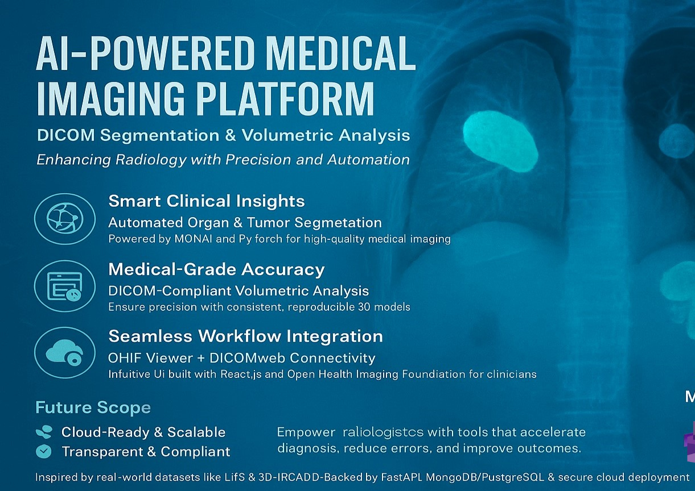

# 🧠 AI-Powered Medical Imaging Platform

A modular deep learning pipeline for automated organ and tumor segmentation using 3D CT scans. The platform integrates DICOM-compliant output, interactive visualization with OHIF Viewer, and PACS-based workflows using Orthanc.

> Designed to improve diagnostic efficiency and consistency by leveraging state-of-the-art AI models and medical imaging standards.

---

## 📷 Demo

### 🔍 Segmentation in OHIF Viewer



### 📌 Project Poster



---

## 🚀 Features

* ✅ **Automated Organ/Tumor Segmentation** using MONAI + PyTorch
* ✅ **Volumetric Analysis & DICOM SEG Export**
* ✅ **OHIF Viewer for Visual Review** (DICOMweb-enabled)
* ✅ **Orthanc PACS Integration** for DICOM storage and retrieval
* ✅ **Modular & Extendable** for multiple organ segmentation tasks
* ✅ **Cloud-Ready Architecture** (FastAPI backend, scalable model deployment)

---

## 🧪 Dataset

* **Source**: [Medical Segmentation Decathlon](http://medicaldecathlon.com/)
* **Format**: NIfTI (.nii.gz)
* **Note**: This platform supports any 3D CT-based dataset and can be easily adapted for liver, spleen, kidney, or tumor segmentation tasks.

---

## 🧠 AI Model Details

* **Architecture**: 3D UNet from MONAI (`monai.networks.nets.UNet`)
* **Loss Function**: DiceLoss
* **Optimization**: Adam
* **Metrics**: Dice Score, Hausdorff Distance
* **Performance**: High segmentation accuracy (>0.95 Dice on organ datasets)

---

## 📁 Folder Structure

```
ai-medical-image-segmentation-platform/
├── notebooks/
│   ├── Training_Pipeline.ipynb
│   └── Model_Inference.ipynb
├── assets/
│   ├── ohif-screenshot.png
│   └── poster_1.png
├── models/
│   └── best_model.pth
├── requirements.txt
└── README.md
```

---

## 🖥️ OHIF + Orthanc Setup Instructions

### 🛠️ Prerequisites

* Node.js (v16+)
* Docker & Docker Compose
* Yarn (Classic)

---

### 🤩 Setup Instructions

#### 🛆 1. Clone the OHIF Viewer

```bash
git clone https://github.com/OHIF/Viewers.git
cd Viewers
yarn install
```

#### ⚙️ 2. Configure for Orthanc

Update `.env` in `platform/app/`:

```bash
REACT_APP_USE_SERVER_CONFIG=true
REACT_APP_CONFIG_NAME=orthanc
```

Create `platform/app/public/config/orthanc.js`:

```js
window.config = {
  routerBasename: '/',
  servers: [
    {
      id: 'orthanc',
      name: 'Orthanc PACS',
      wadoUriRoot: 'http://localhost:8042/wado',
      qidoRoot: 'http://localhost:8042/dicom-web',
      wadoRoot: 'http://localhost:8042/dicom-web',
      dicomWeb: {
        requestOptions: {
          requestFromBrowser: true,
        },
      },
    },
  ],
};
```

---

#### ▶️ 3. Start OHIF Viewer

```bash
yarn dev:orthanc
```

Open: [http://localhost:3000](http://localhost:3000)

---

#### 🐳 4. Start Orthanc Server

```bash
docker run -d \
  --name orthanc \
  -p 8042:8042 -p 4242:4242 \
  jodogne/orthanc-plugins
```

Access Orthanc Explorer at: [http://localhost:8042](http://localhost:8042)

---

## 🔄 Future Scope

* 🧠 Support for multiple organs and multi-label segmentation
* 📂 Integration with MongoDB/PostgreSQL for clinical metadata
* 🌐 RESTful API backend with FastAPI
* 📄 DICOM SEG export from NIfTI using `itkimage2segimage`
* 🏥 Enhanced radiology workflow integration (PACS/RIS/HIS)

---

## 📘 Citation

If you use or reference this platform, please cite:

> "AI-Powered Medical Imaging: DICOM Segmentation & Volumetric Analysis for Clinical Decision Support." Saskatchewan Polytechnic Capstone Project, 2025.

---
---

## 📜 License

This project is licensed under the MIT License.
